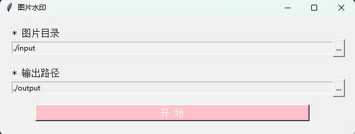

# semi-utils-withgui

> 原项目：
> 
> <https://github.com/leslievan/semi-utils/>
> 
> 原项目 readme: [README](_README.md)

> [](https://github.com/pxoxq/semi-utils-withgui)
> [](https://github.com/pxoxq/semit-utils/releases)
> [](https://github.com/pxoxq/semi-utils-withgui/releases)
> [](https://github.com/pxoxq/semi-utils-withgui/blob/master/LICENSE)
> 
>
> **这是一个用于给照片批量添加水印、处理照片像素比、图像色彩和质量的工具。我基于原来的代码，添加了一点简单的GUI**

## 下载

[点击下载最新](https://github.com/pxoxq/semi-utils-withgui/releases)

## GUI界面



如果您觉得程序对您有所帮助的话，可以点击 [Sponsor](https://cdn.lsvm.xyz/wechat.jpg) 按钮请原作者喝杯咖啡，谢谢！


## 打包 EXE

```commandline
pyinstaller ./main.spec
```

## 原项目开发文档

**[Wiki](../../wiki)**